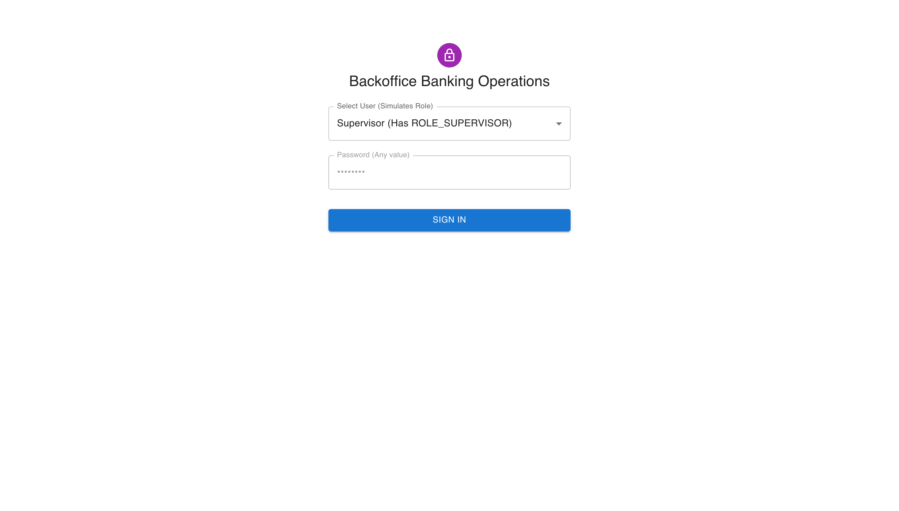
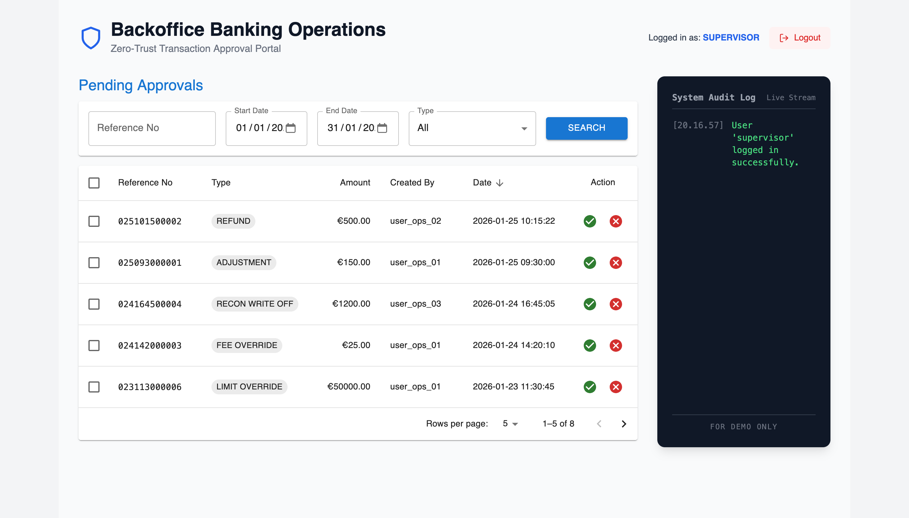
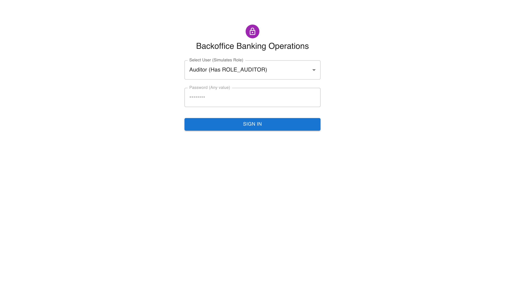
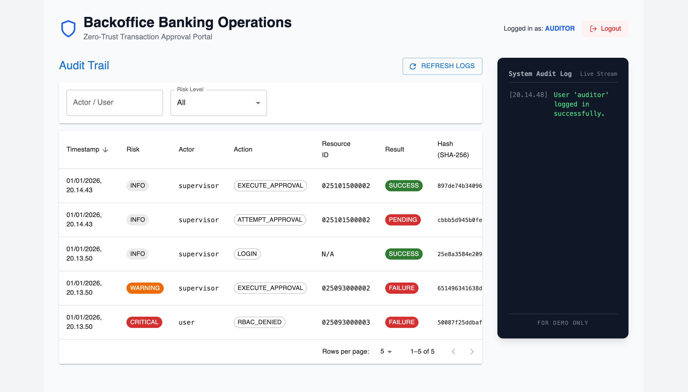
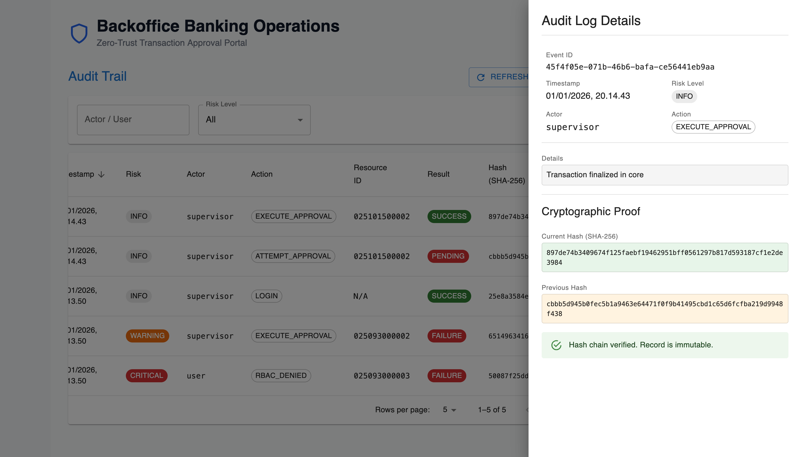

# 🏦 Backoffice UI

This directory contains the frontend application for the Zossen project, a modern web interface built with React and Vite, styled with Material UI to simulate a professional banking operations portal.

## 🚀 Technology Stack

- **Framework**: React
- **Build Tool**: Vite
- **UI Components**: Material UI
- **Styling**: TailwindCSS (for layout and custom styling)
- **API Communication**: Axios
- **Language**: TypeScript

## ⚙️ Running the Application

**Prerequisites:**
- Node.js and npm installed.
- The Zossen Spring Boot backend must be running on `localhost:8080`.

1.  **Navigate to the directory:**
    ```sh
    cd backoffice-ui
    ```

2.  **Install dependencies:**
    ```sh
    npm install
    ```

3.  **Start the development server:**
    ```sh
    npm run dev
    ```

4.  **Open your browser** and navigate to `http://localhost:5173` (or the URL provided by Vite).

## 🌊 User Flow for Showcase

This application is designed to demonstrate a clear, role-based "separation of duties" workflow between a **Supervisor** (who performs actions) and an **Auditor** (who reviews them).

### Step 1: Login as Supervisor

First, simulate the role of an operational supervisor who needs to approve a high-risk transaction.

1.  Select **Supervisor** from the dropdown menu.
2.  Click **Sign In**.


---

### Step 2: Approve a Transaction

As the Supervisor, you are presented with a list of pending approvals.

1.  On any row in the "Pending Approvals" table, click the **green checkmark icon** to approve the transaction.
2.  The row will disappear from the list, and a success notification will appear. In the background, this action has been securely logged by the Z-Trust audit engine.
3.  **Logout** using the button in the top-right corner.


---

### Step 3: Login as Auditor

Now, switch roles to an independent auditor who needs to review all system activities.

1.  Select **Auditor** from the dropdown menu on the Login page.
2.  Click **Sign In**.

---

### Step 4: Review the Audit Trail

As the Auditor, you are presented with the immutable Audit Trail.

1.  You will see a list of all system events, including the transaction you just approved as the Supervisor. The risk level is automatically classified (e.g., `INFO`).
2.  The list is pre-populated with **CRITICAL** and **WARNING** events to demonstrate risk classification.



3.  Click on any row to open a details panel, which includes the **cryptographic hash chain**, proving the log's integrity.



This flow demonstrates the core principle of Zero-Trust: every privileged action is authenticated, authorized, and immutably recorded for independent review.
